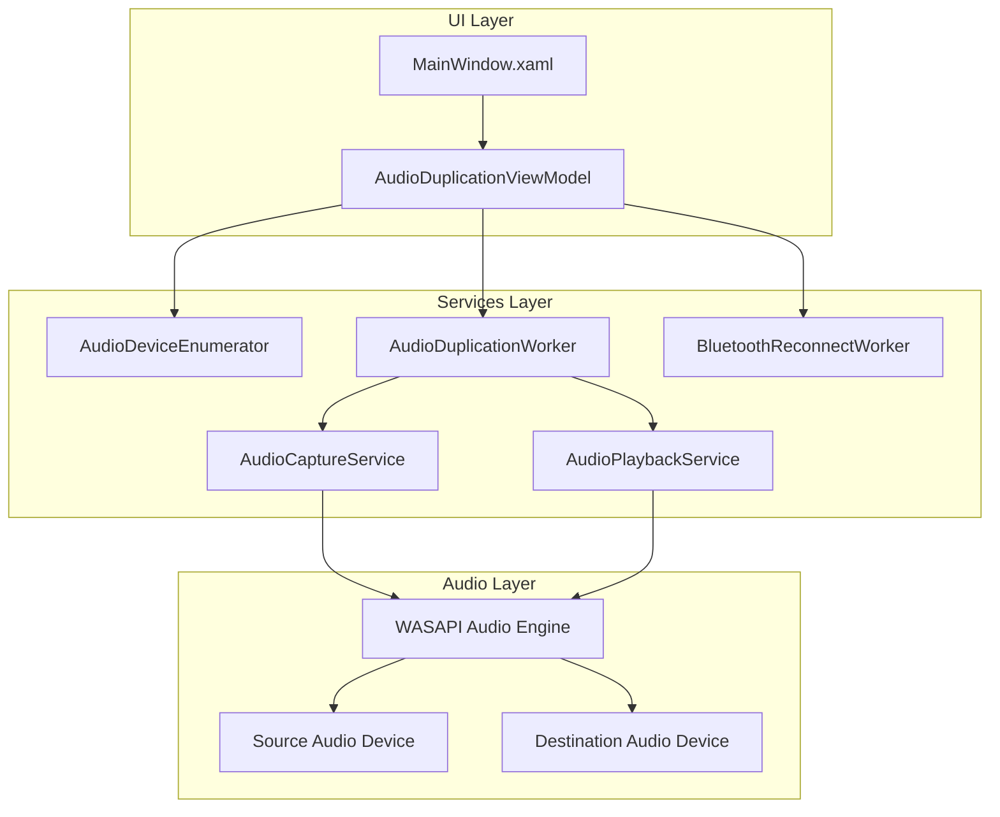
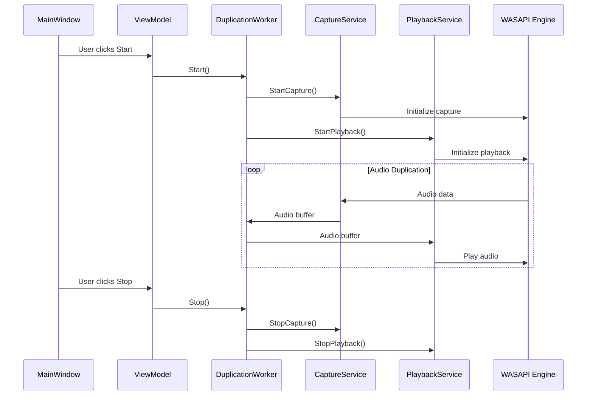

# Audio Duplication Application - Implementation Plan

## Project Overview
Create a Windows application that intercepts audio destined for a specific device and duplicates that audio to a second device.

## Technology Stack
- **Language**: C# (.NET 8.0 or later)
- **UI Framework**: WPF (Windows Presentation Foundation)
- **Audio Library**: NAudio (for WASAPI audio capture/playback)
- **Architecture**: MVVM (Model-View-ViewModel) pattern

## System Architecture



## Project Structure

```
AudioDuplication/
├── AudioDuplication.sln
├── AudioDuplication/
│   ├── App.xaml
│   ├── App.xaml.cs
│   ├── MainWindow.xaml
│   ├── MainWindow.xaml.cs
│   ├── ViewModels/
│   │   └── AudioDuplicationViewModel.cs
│   ├── Services/
│   │   ├── IAudioDeviceEnumerator.cs
│   │   ├── AudioDeviceEnumerator.cs
│   │   ├── IAudioCaptureService.cs
│   │   ├── AudioCaptureService.cs
│   │   ├── IAudioPlaybackService.cs
│   │   ├── AudioPlaybackService.cs
│   │   ├── IAudioDuplicationWorker.cs
│   │   ├── AudioDuplicationWorker.cs
│   │   ├── IBluetoothReconnectWorker.cs
│   │   └── BluetoothReconnectWorker.cs
│   ├── Models/
│   │   └── AudioDeviceInfo.cs
│   └── Resources/
│       └── Styles.xaml
└── packages/
```

## Component Details

### 1. UI Layer (MainWindow.xaml)

**Controls Required:**
- ComboBox for Source Device Selection
- ComboBox for Destination Device Selection
- Toggle Switch for Enable/Disable Duplication
- Button for Start Duplication
- Button for Stop Duplication
- Status Indicator (Text/Icon) showing current state
- (Optional) Toggle Switch for Bluetooth Auto-Reconnect
- (Optional) Status Indicator for Bluetooth Connection

**Layout:**
```
+----------------------------------+
| Audio Duplication Application    |
+----------------------------------+
| Source Device:    [Dropdown v]   |
| Destination Dev:  [Dropdown v]   |
|                                  |
| [x] Enable Duplication           |
|                                  |
| [Start Duplication] [Stop]      |
|                                  |
| Status: Idle / Active / Error    |
|                                  |
| [x] Auto-Reconnect Bluetooth     |
| BT Status: Connected / Disconnected|
+----------------------------------+
```

### 2. Audio Device Enumerator Service

**Responsibilities:**
- Enumerate all available audio output devices
- Enumerate all available audio input devices
- Provide device information (name, ID, state)
- Monitor device connection/disconnection events

**Key Methods:**
- `GetOutputDevices()` - Returns list of output devices
- `GetInputDevices()` - Returns list of input devices
- `SubscribeToDeviceChanges()` - Subscribe to device change events

### 3. Audio Capture Service

**Responsibilities:**
- Initialize WASAPI capture from source device
- Capture audio data in real-time
- Provide audio buffer to duplication worker
- Handle format conversion if needed

**Key Methods:**
- `Initialize(deviceId)` - Initialize capture for device
- `StartCapture()` - Begin capturing audio
- `StopCapture()` - Stop capturing
- `GetAudioBuffer()` - Get captured audio data

### 4. Audio Playback Service

**Responsibilities:**
- Initialize WASAPI playback to destination device
- Play audio data received from duplication worker
- Handle buffer management and timing
- Handle format conversion if needed

**Key Methods:**
- `Initialize(deviceId)` - Initialize playback for device
- `StartPlayback()` - Begin playback
- `StopPlayback()` - Stop playback
- `QueueAudioBuffer(buffer)` - Queue audio for playback

### 5. Audio Duplication Worker

**Responsibilities:**
- Run as background task
- Continuously read from capture service
- Write to playback service
- Handle synchronization and timing
- Report status to ViewModel

**Key Methods:**
- `Start()` - Start duplication task
- `Stop()` - Stop duplication task
- `IsRunning` - Property indicating running state

### 6. Bluetooth Reconnect Worker (Optional)

**Responsibilities:**
- Monitor destination device connection status
- Attempt to reconnect if device is disconnected
- Report connection status to ViewModel
- Respect auto-reconnect toggle setting

**Key Methods:**
- `StartMonitoring()` - Start monitoring device
- `StopMonitoring()` - Stop monitoring
- `AttemptReconnect()` - Try to reconnect device

## Data Flow



## Implementation Steps

### Phase 1: Project Setup
1. Create WPF solution and project
2. Add NAudio NuGet package
3. Set up MVVM structure (ViewModels folder)
4. Create basic MainWindow layout

### Phase 2: Device Enumeration
1. Implement AudioDeviceInfo model
2. Implement IAudioDeviceEnumerator interface
3. Implement AudioDeviceEnumerator service
4. Connect to ViewModel and populate dropdowns

### Phase 3: Audio Capture
1. Implement IAudioCaptureService interface
2. Implement AudioCaptureService using WASAPI
3. Test audio capture from selected device

### Phase 4: Audio Playback
1. Implement IAudioPlaybackService interface
2. Implement AudioPlaybackService using WASAPI
3. Test audio playback to selected device

### Phase 5: Duplication Worker
1. Implement IAudioDuplicationWorker interface
2. Implement AudioDuplicationWorker as background task
3. Connect capture and playback services
4. Implement start/stop logic

### Phase 6: UI Integration
1. Wire up all controls to ViewModel
2. Implement enable/disable toggle
3. Add status indicators
4. Add error handling and user notifications

### Phase 7: Optional Features
1. Implement Bluetooth reconnection worker
2. Add auto-reconnect toggle
3. Add Bluetooth status indicator

### Phase 8: Testing & Documentation
1. Test full workflow
2. Test error scenarios
3. Create user documentation
4. Create README

## Key Technical Considerations

### Audio Format Handling
- Source and destination devices may have different sample rates/bit depths
- Need to handle format conversion using NAudio's resampling capabilities
- Buffer size optimization to minimize latency

### Threading
- Audio capture/playback must run on dedicated threads
- UI updates must be marshaled to UI thread
- Use Task/async-await for background operations

### Error Handling
- Device disconnection during active duplication
- Format incompatibility between devices
- Insufficient system resources
- Permission issues

### Performance
- Minimize latency between capture and playback
- Efficient buffer management
- Avoid blocking UI thread

## Dependencies

### NuGet Packages
- `NAudio` - Core audio library
- `Microsoft.Extensions.DependencyInjection` - DI container (optional)
- `CommunityToolkit.Mvvm` - MVVM helpers (optional)

### System Requirements
- Windows 10 or later
- .NET 8.0 Runtime
- Audio devices (at least one output device)

## Success Criteria

1. User can select source and destination audio devices
2. Audio from source device is duplicated to destination device
3. Start/stop controls work correctly
4. Enable/disable toggle works correctly
5. Status indicators accurately reflect system state
6. Application handles device disconnection gracefully
7. (Optional) Bluetooth auto-reconnect works as expected
8. Low latency audio duplication (< 100ms)
