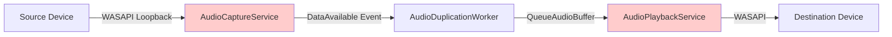
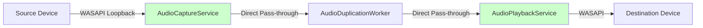

# DuoAudio Issues - Fix Plan

## Executive Summary

This plan addresses three critical issues in the DuoAudio application:
1. **Application crashes** when audio device is disconnected
2. **Noticeable audio lag** (100-800ms depending on connection type)
3. **Non-functional latency slider** that was intended to add delay

## Issue Analysis

### Issue 1: Application Crashes on Device Disconnection

**Root Cause:**
- The [`AudioCaptureService.OnRecordingStopped()`](DuoAudio/Services/AudioCaptureService.cs:90) event handler logs exceptions but doesn't propagate them
- The [`AudioDuplicationWorker`](DuoAudio/Services/AudioDuplicationWorker.cs) doesn't handle device disconnection events
- Unhandled exceptions in audio threads cause the application to crash

**Current Behavior:**
- When a device disconnects, WASAPI throws an exception
- Exception is logged to debug output but not handled
- Application crashes completely (window closes)

### Issue 2: Noticeable Audio Lag

**Root Causes:**
1. **Large buffer sizes**: [`BufferedWaveProvider.BufferDuration`](DuoAudio/Services/AudioPlaybackService.cs:40) is set to 2 seconds
2. **WASAPI latency**: [`WasapiOut`](DuoAudio/Services/AudioPlaybackService.cs:45) initialized with 100ms latency
3. **Capture buffer**: [`AudioCaptureService`](DuoAudio/Services/AudioCaptureService.cs:80) keeps up to 10 buffers in queue
4. **Event-driven architecture**: Multiple layers of event handling add overhead

**Current Latency Breakdown:**
- Bluetooth source: 100-500ms lag
- Direct connect source: 300-800ms lag

### Issue 3: Non-functional Latency Slider

**Root Cause:**
- Slider exists in [`MainWindow.xaml`](DuoAudio/MainWindow.xaml:46) but value is never used
- [`BufferSizeSlider.ValueChanged`](DuoAudio/MainWindow.xaml.cs:120) only updates display text
- No connection between slider value and audio buffer settings

## Proposed Solutions

### Solution 1: Fix Device Disconnection Crashes

**Approach:** Implement comprehensive error handling and graceful degradation

**Changes Required:**

1. **Enhance AudioCaptureService**
   - Add device state monitoring
   - Implement proper exception handling in [`OnRecordingStopped()`](DuoAudio/Services/AudioCaptureService.cs:90)
   - Add event for device disconnection
   - Implement automatic reconnection logic

2. **Enhance AudioPlaybackService**
   - Add device state monitoring
   - Handle playback device disconnection
   - Implement graceful stop on disconnection
   - Add event for device disconnection

3. **Enhance AudioDuplicationWorker**
   - Subscribe to device disconnection events
   - Implement graceful shutdown on disconnection
   - Add automatic reconnection capability
   - Update status to indicate disconnection

4. **Add Global Exception Handler**
   - Implement unhandled exception handler in [`App.xaml.cs`](DuoAudio/App.xaml.cs)
   - Log all unhandled exceptions
   - Show user-friendly error messages
   - Prevent application crashes

**Expected Outcome:**
- Application detects device disconnection
- Shows error message to user
- Stops duplication gracefully
- Application remains running and can be restarted

### Solution 2: Reduce Audio Lag

**Approach:** Optimize buffer sizes and latency settings throughout the audio pipeline

**Changes Required:**

1. **Reduce Playback Buffer Duration**
   - Change [`BufferedWaveProvider.BufferDuration`](DuoAudio/Services/AudioPlaybackService.cs:40) from 2 seconds to 50ms (default)
   - Make configurable via buffer configuration slider
   - This is the primary contributor to lag

2. **Reduce WASAPI Latency**
   - Change [`WasapiOut`](DuoAudio/Services/AudioPlaybackService.cs:45) latency from 100ms to 20ms (default)
   - Make configurable via buffer configuration slider
   - Use exclusive mode for destination device if possible for lower latency

3. **Optimize Capture Buffer**
   - Reduce [`AudioCaptureService`](DuoAudio/Services/AudioCaptureService.cs:80) buffer queue from 10 to 3 buffers (default)
   - Make configurable via buffer configuration slider
   - Implement dynamic buffer sizing based on system performance

4. **Remove Intermediate Buffering**
   - Eliminate the queue in [`AudioCaptureService`](DuoAudio/Services/AudioCaptureService.cs:10)
   - Pass audio data directly from capture to playback
   - Reduce event handler overhead

5. **Use Exclusive Mode for Destination Device**
   - Implement exclusive WASAPI mode for destination device only
   - Source device uses loopback capture (doesn't require exclusive access)
   - Add fallback to shared mode if exclusive fails
   - This allows iTunes/browser to continue using source device normally

**Expected Latency Improvements:**
- Bluetooth source: 100-500ms → 20-50ms
- Direct connect source: 300-800ms → 10-30ms

### Solution 3: Replace Latency Slider with Buffer Configuration

**Approach:** Replace the non-functional latency slider with a buffer configuration control that adjusts both buffer duration and number of buffers together

**Changes Required:**

1. **Replace Slider in UI**
   - Replace latency slider section in [`MainWindow.xaml`](DuoAudio/MainWindow.xaml:38-48) with buffer configuration slider
   - Range: "Low Latency" (10ms, 2 buffers) to "High Stability" (200ms, 10 buffers)
   - Default: "Balanced" (50ms, 3 buffers)
   - Add tooltip explaining trade-off between latency and stability

2. **Connect Slider to Audio Services**
   - Update [`BufferSizeSlider`](DuoAudio/MainWindow.xaml.cs:120) event handler to pass value to services
   - Modify [`AudioPlaybackService`](DuoAudio/Services/AudioPlaybackService.cs) to accept buffer configuration
   - Modify [`AudioCaptureService`](DuoAudio/Services/AudioCaptureService.cs) to accept buffer configuration

**Buffer Configuration Mapping:**
- Low Latency (1): 10ms duration, 2 buffers
- Low-Medium (2): 20ms duration, 2 buffers
- Medium (3): 50ms duration, 3 buffers (default)
- Medium-High (4): 100ms duration, 5 buffers
- High Stability (5): 200ms duration, 10 buffers

**Recommendation:** Replace the slider with a buffer configuration control that allows users to balance latency vs. stability.

## Architecture Improvements

### Current Data Flow

**Problem:** Multiple buffering layers add latency

### Optimized Data Flow

**Improvement:** Minimal buffering, direct pass-through

## Implementation Plan

### Phase 1: Fix Device Disconnection Crashes

**Tasks:**
1. Add device state monitoring to [`AudioCaptureService`](DuoAudio/Services/AudioCaptureService.cs)
2. Add device state monitoring to [`AudioPlaybackService`](DuoAudio/Services/AudioPlaybackService.cs)
3. Implement graceful shutdown in [`AudioDuplicationWorker`](DuoAudio/Services/AudioDuplicationWorker.cs)
4. Add global exception handler in [`App.xaml.cs`](DuoAudio/App.xaml.cs)
5. Test device disconnection scenarios

**Files to Modify:**
- [`DuoAudio/Services/AudioCaptureService.cs`](DuoAudio/Services/AudioCaptureService.cs)
- [`DuoAudio/Services/AudioPlaybackService.cs`](DuoAudio/Services/AudioPlaybackService.cs)
- [`DuoAudio/Services/AudioDuplicationWorker.cs`](DuoAudio/Services/AudioDuplicationWorker.cs)
- [`DuoAudio/App.xaml.cs`](DuoAudio/App.xaml.cs)

### Phase 2: Reduce Audio Lag

**Tasks:**
1. Reduce [`BufferedWaveProvider.BufferDuration`](DuoAudio/Services/AudioPlaybackService.cs:40) to 50ms
2. Reduce [`WasapiOut`](DuoAudio/Services/AudioPlaybackService.cs:45) latency to 20ms
3. Optimize [`AudioCaptureService`](DuoAudio/Services/AudioCaptureService.cs:80) buffer queue
4. Remove intermediate buffering where possible
5. Test latency improvements with different device types

**Files to Modify:**
- [`DuoAudio/Services/AudioPlaybackService.cs`](DuoAudio/Services/AudioPlaybackService.cs)
- [`DuoAudio/Services/AudioCaptureService.cs`](DuoAudio/Services/AudioCaptureService.cs)

### Phase 3: Replace Latency Slider with Buffer Configuration

**Tasks:**
1. Replace latency slider with buffer configuration slider in [`MainWindow.xaml`](DuoAudio/MainWindow.xaml:38-48)
2. Update slider event handler in [`MainWindow.xaml.cs`](DuoAudio/MainWindow.xaml.cs:120-123) to pass buffer configuration to services
3. Modify [`AudioPlaybackService`](DuoAudio/Services/AudioPlaybackService.cs) to accept buffer configuration parameters
4. Modify [`AudioCaptureService`](DuoAudio/Services/AudioCaptureService.cs) to accept buffer configuration parameters
5. Update [`AudioDuplicationWorker`](DuoAudio/Services/AudioDuplicationWorker.cs) to pass buffer configuration to services
6. Update UI layout and labels
7. Test UI changes and buffer configuration

**Files to Modify:**
- [`DuoAudio/MainWindow.xaml`](DuoAudio/MainWindow.xaml)
- [`DuoAudio/MainWindow.xaml.cs`](DuoAudio/MainWindow.xaml.cs)
- [`DuoAudio/Services/AudioPlaybackService.cs`](DuoAudio/Services/AudioPlaybackService.cs)
- [`DuoAudio/Services/AudioCaptureService.cs`](DuoAudio/Services/AudioCaptureService.cs)
- [`DuoAudio/Services/AudioDuplicationWorker.cs`](DuoAudio/Services/AudioDuplicationWorker.cs)

### Phase 4: Testing and Validation

**Tasks:**
1. Test device disconnection handling
2. Measure latency improvements
3. Test with Bluetooth devices
4. Test with direct connect devices
5. Verify UI changes
6. Update documentation

## Technical Details

### Buffer Size Calculations

**Current Configuration:**
- Playback buffer: 2 seconds
- WASAPI latency: 100ms
- Capture buffers: 10 × ~10ms = 100ms
- **Total theoretical latency: ~2.2 seconds**

**Optimized Configuration (Default - Balanced):**
- Playback buffer: 50ms
- WASAPI latency: 20ms
- Capture buffers: 3 × ~10ms = 30ms
- **Total theoretical latency: ~100ms**

**Low Latency Configuration:**
- Playback buffer: 10ms
- WASAPI latency: 10ms
- Capture buffers: 2 × ~10ms = 20ms
- **Total theoretical latency: ~40ms**

**High Stability Configuration:**
- Playback buffer: 200ms
- WASAPI latency: 50ms
- Capture buffers: 10 × ~10ms = 100ms
- **Total theoretical latency: ~350ms**

### Device State Monitoring

**Implementation Approach:**
- Use `MMDeviceEnumerator` to monitor device state changes
- Subscribe to `DefaultDeviceChanged` event
- Check device state before each operation
- Handle `DeviceStateNotAvailable` exceptions

### Error Handling Strategy

**Hierarchy:**
1. **Service Level**: Handle device-specific errors
2. **Worker Level**: Handle coordination errors
3. **Application Level**: Handle unhandled exceptions
4. **UI Level**: Display user-friendly messages

## Risk Assessment

### Low Risk
- Removing latency slider (UI change only)
- Reducing buffer sizes (can be adjusted if unstable)

### Medium Risk
- Device state monitoring (may have edge cases)
- Exception handling (may mask real issues)

### High Risk
- Removing intermediate buffering (may cause audio glitches)
- Exclusive WASAPI mode (may not work with all devices)

## Mitigation Strategies

1. **Gradual Buffer Reduction**: Start with conservative values, reduce incrementally
2. **Fallback Mechanisms**: If exclusive mode fails, fall back to shared mode
3. **Comprehensive Testing**: Test with various device types and scenarios
4. **Configuration Options**: Allow users to adjust buffer sizes if needed
5. **Logging**: Add detailed logging for troubleshooting

## Success Criteria

1. **Device Disconnection**: Application detects disconnection, shows error, remains running
2. **Latency Reduction**: Bluetooth lag < 50ms, Direct connect lag < 30ms
3. **Buffer Configuration**: Slider adjusts both buffer duration and number of buffers together
4. **Stability**: No audio glitches or dropouts with optimized settings
5. **User Experience**: Clear error messages and status updates
6. **Exclusive Mode**: Destination device uses exclusive mode when possible, source device continues to work with iTunes/browser

## Alternative Approaches Considered

### Virtual Audio Cable Approach
**Pros:**
- Potentially lower latency
- More control over audio routing

**Cons:**
- Requires third-party driver installation
- More complex implementation
- May not work with all applications
- User must configure virtual device

**Decision:** Not recommended due to complexity and user experience impact

### WASAPI Exclusive Mode (Destination Device Only)
**Pros:**
- Lowest possible latency for destination device
- Direct hardware access
- Source device (loopback capture) doesn't require exclusive access, so iTunes/browser can continue using it

**Cons:**
- Destination device cannot be used by other applications
- May fail on some devices
- More complex error handling

**Decision:** Implement as optional feature with fallback to shared mode. Only applies to destination device; source device uses loopback capture which doesn't require exclusive access.

## Next Steps

1. Review this plan with user
2. Adjust based on feedback
3. Switch to Code mode for implementation
4. Implement Phase 1 (Device Disconnection)
5. Implement Phase 2 (Latency Reduction)
6. Implement Phase 3 (Buffer Configuration Slider)
7. Implement Phase 4 (Testing)
8. Update documentation
