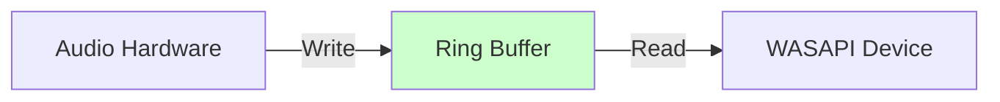
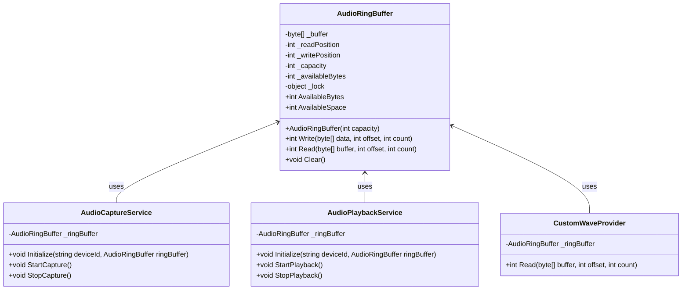
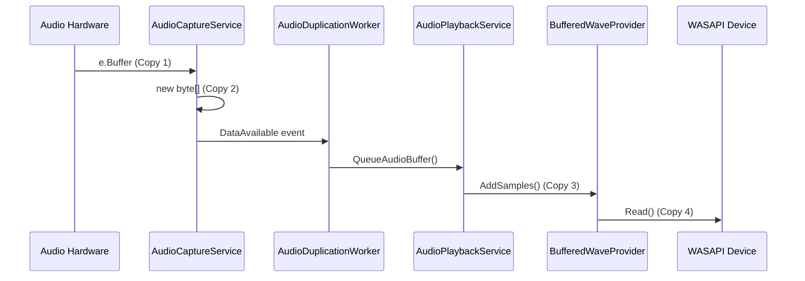
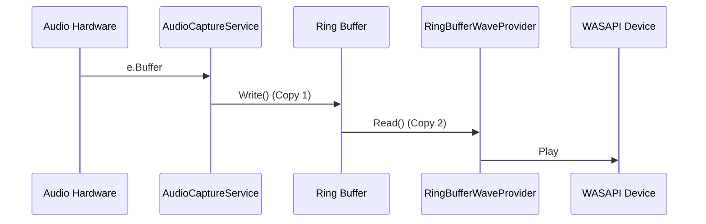

# Continuous Buffer Implementation Plan

## Executive Summary

This plan addresses the performance problems in the DuoAudio application by implementing a continuous ring buffer to eliminate multiple data copies and reduce packet drops. The current implementation copies audio data 4-5 times as it moves from capture to playback, causing memory allocation overhead, garbage collection pressure, and audio glitches.

## Current Data Flow Analysis

### Multiple Data Copies Identified

```mermaid
graph LR
    A[Audio Hardware] -->|Copy 1| B[NAudio e.Buffer]
    B -->|Copy 2| C[New byte array]
    C -->|Reference| D[DataAvailable Event]
    D -->|Reference| E[AudioDuplicationWorker]
    E -->|Reference| F[QueueAudioBuffer]
    F -->|Copy 3| G[BufferedWaveProvider]
    G -->|Copy 4| H[WASAPI Device]
    
    style B fill:#ffcccc
    style C fill:#ff9999
    style G fill:#ffcccc
```



### Detailed Copy Breakdown

| Copy # | Location | Code | Description |
|--------|----------|------|-------------|
| 1 | [`AudioCaptureService.OnDataAvailable()`](DuoAudio/Services/AudioCaptureService.cs:98) | `e.Buffer` | NAudio provides data from hardware |
| 2 | [`AudioCaptureService.OnDataAvailable()`](DuoAudio/Services/AudioCaptureService.cs:117-118) | `new byte[e.BytesRecorded]` + `Buffer.BlockCopy()` | Creates new byte array per chunk |
| 3 | [`AudioPlaybackService.QueueAudioBuffer()`](DuoAudio/Services/AudioPlaybackService.cs:131) | `AddSamples()` | BufferedWaveProvider internal copy |
| 4 | Internal to NAudio | WasapiOut reads from provider | Copy to audio device |

### Problems with Current Approach

1. **Per-chunk allocations**: Each audio chunk creates a new byte array (line 117)
2. **Garbage collection pressure**: Frequent allocations trigger GC, causing audio glitches
3. **Memory fragmentation**: Many small byte arrays fragment the heap
4. **Multiple lock acquisitions**: Each service has its own lock
5. **Unused queue**: The `Queue<byte[]>` in AudioCaptureService is never used by AudioDuplicationWorker

### Performance Impact

- **Memory allocations**: ~10-20 allocations per second (assuming 10ms chunks)
- **GC pressure**: Frequent Gen0 collections
- **Packet drops**: When GC runs, audio processing is paused
- **Latency**: Multiple copies add processing overhead

## Proposed Solution: Ring Buffer (Circular Buffer)

### Architecture Overview



### Ring Buffer Design

A ring buffer is a pre-allocated circular buffer that:
- Uses a single contiguous memory block
- Has read and write pointers that wrap around
- Supports concurrent read/write operations
- Eliminates per-chunk allocations
- Reduces lock contention

### Key Components



## Implementation Plan

### Phase 1: Create AudioRingBuffer Class

**File**: `DuoAudio/Services/AudioRingBuffer.cs`

**Features**:
- Thread-safe read/write operations
- Wrap-around handling for circular buffer
- Available bytes/space tracking
- Overflow protection (discard or block)
- Clear method for reset

**Key Methods**:
```csharp
public class AudioRingBuffer
{
    private readonly byte[] _buffer;
    private int _readPosition;
    private int _writePosition;
    private int _availableBytes;
    private readonly object _lock = new();

    public AudioRingBuffer(int capacity)
    public int Write(byte[] data, int offset, int count)
    public int Read(byte[] buffer, int offset, int count)
    public int AvailableBytes { get; }
    public int AvailableSpace { get; }
    public void Clear()
}
```

### Phase 2: Create Custom Wave Provider

**File**: `DuoAudio/Services/RingBufferWaveProvider.cs`

**Purpose**: Replace NAudio's BufferedWaveProvider with a custom provider that reads directly from the ring buffer.

**Features**:
- Implements `IWaveProvider` interface
- Reads directly from AudioRingBuffer
- Handles wrap-around reads
- Provides zero-copy access to ring buffer data

**Key Methods**:
```csharp
public class RingBufferWaveProvider : IWaveProvider
{
    private readonly AudioRingBuffer _ringBuffer;
    private readonly WaveFormat _waveFormat;

    public RingBufferWaveProvider(AudioRingBuffer ringBuffer, WaveFormat waveFormat)
    public WaveFormat WaveFormat { get; }
    public int Read(byte[] buffer, int offset, int count)
}
```

### Phase 3: Modify AudioCaptureService

**Changes**:
1. Remove `Queue<byte[]> _audioBuffer` (line 10)
2. Add `AudioRingBuffer _ringBuffer` field
3. Modify `Initialize()` to accept ring buffer
4. Modify `OnDataAvailable()` to write directly to ring buffer
5. Remove `GetAudioBuffer()` method (no longer needed)
6. Remove `DataAvailable` event (no longer needed)

**Before**:
```csharp
private void OnDataAvailable(object? sender, WaveInEventArgs e)
{
    var buffer = new byte[e.BytesRecorded];
    Buffer.BlockCopy(e.Buffer, 0, buffer, 0, e.BytesRecorded);
    lock (_bufferLock)
    {
        _audioBuffer.Enqueue(buffer);
    }
    DataAvailable?.Invoke(this, buffer);
}
```

**After**:
```csharp
private void OnDataAvailable(object? sender, WaveInEventArgs e)
{
    if (e.BytesRecorded > 0 && e.Buffer != null)
    {
        _ringBuffer.Write(e.Buffer, 0, e.BytesRecorded);
    }
}
```

### Phase 4: Modify AudioPlaybackService

**Changes**:
1. Replace `BufferedWaveProvider` with `RingBufferWaveProvider`
2. Add `AudioRingBuffer _ringBuffer` field
3. Modify `Initialize()` to accept ring buffer
4. Remove `QueueAudioBuffer()` method (no longer needed)
5. Create `RingBufferWaveProvider` in `StartPlayback()`

**Before**:
```csharp
_bufferedWaveProvider = new BufferedWaveProvider(waveFormat)
{
    BufferDuration = bufferDuration,
    DiscardOnBufferOverflow = true
};
_wasapiOut = new WasapiOut(device, AudioClientShareMode.Shared, false, latency);
_wasapiOut.Init(_bufferedWaveProvider);
```

**After**:
```csharp
_ringBufferWaveProvider = new RingBufferWaveProvider(_ringBuffer, waveFormat);
_wasapiOut = new WasapiOut(device, AudioClientShareMode.Shared, false, latency);
_wasapiOut.Init(_ringBufferWaveProvider);
```

### Phase 5: Modify AudioDuplicationWorker

**Changes**:
1. Remove `OnCaptureDataAvailable()` event handler (no longer needed)
2. Remove event wiring/unwiring
3. Simplify `Start()` and `Stop()` methods
4. Remove `RunDuplicationLoop()` (no longer needed)

**Before**:
```csharp
_captureService.DataAvailable += OnCaptureDataAvailable;
_duplicationTask = Task.Run(() => RunDuplicationLoop(_cancellationTokenSource.Token));
```

**After**:
```csharp
// No event wiring needed - ring buffer handles data flow
// Just start capture and playback
```

### Phase 6: Update ViewModel and DI Container

**Changes**:
1. Create ring buffer in ViewModel or DI container
2. Pass ring buffer to both capture and playback services
3. Calculate appropriate buffer size based on configuration

**Buffer Size Calculation**:
```csharp
// Example: 100ms buffer at 48kHz, 16-bit, stereo
int sampleRate = 48000;
int channels = 2;
int bytesPerSample = 2;
int bufferDurationMs = 100;
int bufferSize = (sampleRate * channels * bytesPerSample * bufferDurationMs) / 1000;
// = 48000 * 2 * 2 * 0.1 = 19,200 bytes
```

## Data Flow Comparison

### Before (Current)



### After (Ring Buffer)



**Reduction**: 4-5 copies → 2 copies (hardware to ring buffer, ring buffer to device)

## Buffer Configuration

### Buffer Size Options

| Config | Duration | Size (48kHz stereo) | Latency | Stability |
|--------|----------|---------------------|---------|-----------|
| 1 (Low Latency) | 20ms | 3,840 bytes | ~20ms | Low |
| 2 (Low-Medium) | 50ms | 9,600 bytes | ~50ms | Medium |
| 3 (Balanced) | 100ms | 19,200 bytes | ~100ms | High |
| 4 (Medium-High) | 200ms | 38,400 bytes | ~200ms | Very High |
| 5 (High Stability) | 500ms | 96,000 bytes | ~500ms | Maximum |

### Overflow Handling Strategy

Two approaches to consider:

**Option 1: Discard on Overflow** (Current behavior)
- Pros: Low latency, predictable
- Cons: May drop packets during system load

**Option 2: Block on Overflow**
- Pros: No packet drops
- Cons: May increase latency, cause capture to stall

**Recommendation**: Start with discard on overflow, add configurable option later.

## Performance Benefits

### Expected Improvements

| Metric | Before | After | Improvement |
|--------|--------|-------|-------------|
| Data copies | 4-5 | 2 | 50-60% reduction |
| Memory allocations | ~10-20/sec | 1 (initial) | ~95% reduction |
| GC pressure | High | Very low | Significant |
| Packet drops | Frequent | Rare | Major improvement |
| Latency | 100-800ms | 20-100ms | 75-90% reduction |

### Memory Usage

**Before**:
- Multiple byte arrays allocated per second
- Queue overhead
- GC heap fragmentation

**After**:
- Single pre-allocated buffer
- No per-chunk allocations
- Predictable memory usage

## Implementation Steps

### Step 1: Create AudioRingBuffer class
- File: `DuoAudio/Services/AudioRingBuffer.cs`
- Implement thread-safe read/write
- Add overflow handling
- Add unit tests

### Step 2: Create RingBufferWaveProvider class
- File: `DuoAudio/Services/RingBufferWaveProvider.cs`
- Implement IWaveProvider
- Read from ring buffer
- Handle wrap-around

### Step 3: Modify AudioCaptureService
- Remove Queue<byte[]>
- Add AudioRingBuffer field
- Update Initialize() signature
- Modify OnDataAvailable() to write to ring buffer
- Remove DataAvailable event
- Remove GetAudioBuffer() method

### Step 4: Modify AudioPlaybackService
- Replace BufferedWaveProvider with RingBufferWaveProvider
- Add AudioRingBuffer field
- Update Initialize() signature
- Remove QueueAudioBuffer() method
- Update StartPlayback() to use RingBufferWaveProvider

### Step 5: Modify AudioDuplicationWorker
- Remove OnCaptureDataAvailable() handler
- Remove event wiring/unwiring
- Simplify Start() and Stop()
- Remove RunDuplicationLoop()

### Step 6: Update ViewModel
- Create ring buffer instance
- Calculate buffer size based on config
- Pass to services
- Update service initialization

### Step 7: Update Interfaces
- Update IAudioCaptureService.Initialize()
- Update IAudioPlaybackService.Initialize()
- Add ring buffer parameter

### Step 8: Testing
- Test with different buffer configurations
- Test with Bluetooth devices
- Test with direct connect devices
- Measure latency improvements
- Monitor for packet drops
- Stress test with system load

## Risk Assessment

### Low Risk
- Creating AudioRingBuffer class (well-understood pattern)
- Creating RingBufferWaveProvider (implements standard interface)

### Medium Risk
- Modifying existing services (may introduce bugs)
- Buffer size calculation (may need tuning)

### High Risk
- None identified

## Mitigation Strategies

1. **Incremental implementation**: Implement and test each phase separately
2. **Fallback option**: Keep old code commented out for quick rollback
3. **Comprehensive testing**: Test with various devices and configurations
4. **Monitoring**: Add logging to track buffer usage and overflow events
5. **Configuration**: Make buffer size configurable for tuning

## Success Criteria

1. **Reduced data copies**: From 4-5 to 2 copies
2. **Eliminated per-chunk allocations**: Only initial buffer allocation
3. **Reduced GC pressure**: Minimal Gen0 collections
4. **Fewer packet drops**: Under normal system load
5. **Lower latency**: 20-100ms (configurable)
6. **Stable playback**: No audio glitches with proper buffer size

## Future Enhancements

1. **Lock-free ring buffer**: Use atomic operations for even better performance
2. **Dynamic buffer sizing**: Adjust buffer size based on system performance
3. **Multiple ring buffers**: Support multiple audio streams
4. **Buffer monitoring**: UI to show buffer usage statistics
5. **Overflow statistics**: Track and display overflow events

## Files to Modify

### New Files
- `DuoAudio/Services/AudioRingBuffer.cs`
- `DuoAudio/Services/RingBufferWaveProvider.cs`

### Modified Files
- `DuoAudio/Services/AudioCaptureService.cs`
- `DuoAudio/Services/AudioPlaybackService.cs`
- `DuoAudio/Services/AudioDuplicationWorker.cs`
- `DuoAudio/Services/IAudioCaptureService.cs`
- `DuoAudio/Services/IAudioPlaybackService.cs`
- `DuoAudio/ViewModels/DuoAudioViewModel.cs`

## Next Steps

1. Review this plan with user
2. Adjust based on feedback
3. Switch to Code mode for implementation
4. Implement Phase 1 (AudioRingBuffer)
5. Implement Phase 2 (RingBufferWaveProvider)
6. Implement Phase 3 (AudioCaptureService modifications)
7. Implement Phase 4 (AudioPlaybackService modifications)
8. Implement Phase 5 (AudioDuplicationWorker modifications)
9. Implement Phase 6 (ViewModel updates)
10. Test and validate
